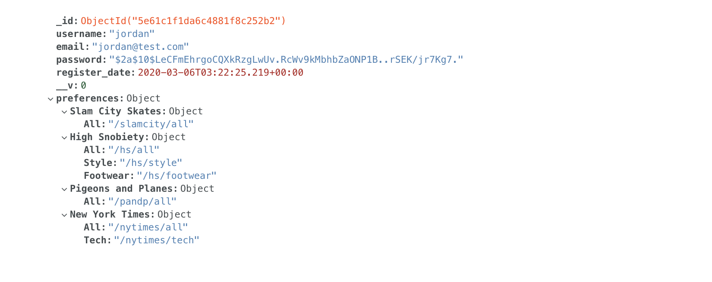
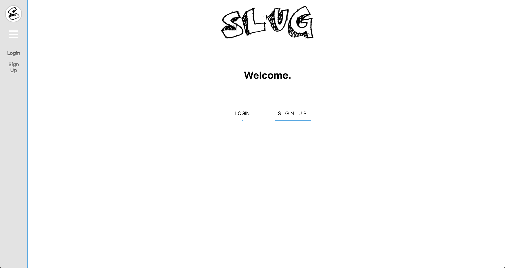

# Slug - A news aggregation platform

_In newspaper editing, a SLUG is a short name given to an article that is in production. The story is labeled with its slug as it makes its way from the reporter through the editorial process._

## Purpose of the site

I'm sure you're familiar with news aggregation sites, this is no different. An application that pulls together news from a variety of sources and categories, and allows users to customise their news reading experience.

## Deployed Project Link

https://jaytees.github.io/frontend-slug/#/

## Brief

## Features

- Select news outlets to subscribe to
- Select categories from those outlets to further Customise your feed
- Toggle which outlets and categories are displayed
- Dynamic dashboard further to customise your feed

## Style

- Simple
- Organised
- Easy to use

## Tech / Framework Used

- React.js
- Node.js
- MongoDB (atlas)
- Mongoose
- Express
- rss-parser
- cheerio
- request
- JWT tokens
- Modular CSS
- Heroku

## Link to the Backend Repo

https://github.com/jaytees/backend-slug

## Process

## Process & Experience

- Full-stack web application, delivering news from 4 sources, each with multiple categories. 1 third party API, 2 RSS feeds and 1 requiring web-scraping.
- All served to the front-end via a RESTful API, based on outlet endpoints and user preferences stored in the DB.
- At the beginning I focused on the complexity of how to deliver JSON from the sources consistently. Using Insomnia and the node debugger to refine the data parsing.
- I then wire-framed the front-end, developed the components and functions to render the AJAX responses. Focusing on keeping the code DRY and state controlled in the top level component.

- I approached this project with a lot more consideration for the underlying architecture than any of my previous projects.
- My goal was to deliver a project where the code looked as good as the design.
- It was a necessary decision as this project was heavily reliant on data from a variety of sources, in different formats and how it was then consolidated to be rendered consistently.
- It was a great challenge and I learnt a lot about parsing data from AJAX requests along the way. I also learnt that it is counter-productive to try and refactor code before you have even written it.

- At the start of this project I had very little experience with Mongodb and Express and having to learn this whilst delivering a project, slowed my progress but I wanted to push myself to learn a new db structure and framework and noSQL was the right choice for this project.
- This added another layer of stress to the project but a great experience and I learnt so much. It was like my first project again, every little bit of functionality was a massive win.

## Wins

- **Handling Endpoint Data** - Particularly how DRY I managed to make the rendering of the feed data. My aim was to have all outlets handled by one component. I achieved this through refactoring how the data was stored on the backend (noSql was a perfect choice for this reason). As well as, creating a function that parsed the user preference data, into a format specifically for the frontend. Although this added an extra step and an extra piece of state. It was more efficient than having to loop through multiple levels of the nested preferences object, multiple times.

- **Centralised State** - I'm really happy with how centrally state is handled. This was one of my goals from the start and I got very close to only having state in the top level component.

- **Environment Variables** - My first time using environment variables and by defining the API endpoint under the same name in production and development I was able to DRY up all my AJAX request to just reference this one variable.

- **Authorisation Middleware for API Endpoints** - Created a function that is passed as a second parameter to the express router. This function first assess the presence of the JWT, then the validity of token and if all is satisfactory returns the user document to the route to continue endpoints functionality. I found this really effective and super easy to understand.

## Challenges

- **Data Handling** - Following on from above to get to that level of satisfaction, took a lot of thought, planning and refactoring. As I mentioned in the experience section of this README, I learned a valuable lesson..."Don't try to refactor code you haven't written". What i mean by this is, I had a clear vision from the offset and knew there was a very clean way to execute this code but due to the volume of data I was handling, it was easy to get lost in how it was being passed around the application, before even attempting it.

- **Handling Preference Update Backend** - This took a lot of researching and testing to get the desired outcome. Mainly due to my lack of knowledge of MongoDB and Mongoose going into this project. Once I had established how to update a document in the required format. I faced two challenges how to handle both the add and remove operations and how to return the updated document. I am particularly proud of the operation ternary to handle the different functions.

## Code

**Parsing Backend Preference Data for Frontend Rendering**

- How the raw preference data from the backend is parsed into a format for the frontend feed component.

- Example document of how outlet information is stored.
- Array of objects for each outlets categories and there endpoints (This is what is used to create the category selection for preference update).

- How these user preferences are then stored on the backend.

- Function so the AJAX response preference data can be handled by the front end components.

- Outcome of how this data is then stored in state and passed to the feed component.

**Handling Preference Update Frontend**

- When making the decision on how to handle the category selection I took into consideration the efficiency and UX of my options. In the end deciding to make an AJAX request on every selection, in favour of keeping the majority of my state in the top level component and the UX reflecting immediate changes.
- I achieved this by passing a click handler down from the top level component, which passed back up the AJAX response, prompting a re-render of the nav bar.

**Handling Preference Update Backend**

- Following on from above, I had to take the data in the selection format from the frontend and parse it into the format required to update the document on the backend.
- Then return the updated document as the response for re-rendering of the DOM.
- Particularly happy with the ternary for which option to perform.

**AJAX Refactoring**

- Refactoring the way AJAX requests are made depending on environment. Required refactoring both the front and back-end. On the front-end making use of environment variables. So I could use one environment for reference for both production and development.

**Backend Auth Middleware**

- Whenever a private route is needed add this piece of middleware as a second parameter in the endpoint.
- Returns the user document.

## Screenshots

- Landing Page

- Profile Set-Up

- Dashboard View

- Profile View

## Next step

- I really want to refactor the backend, so all API request are handled by one single endpoint

## Things to do

- Add more styling
  - Different viewing styles for the dashboard
  - A dark mode
- Resize and rearrange the dashboard modules
- Refactor how outlet images are rendered and stored
- Add default image for missing images
